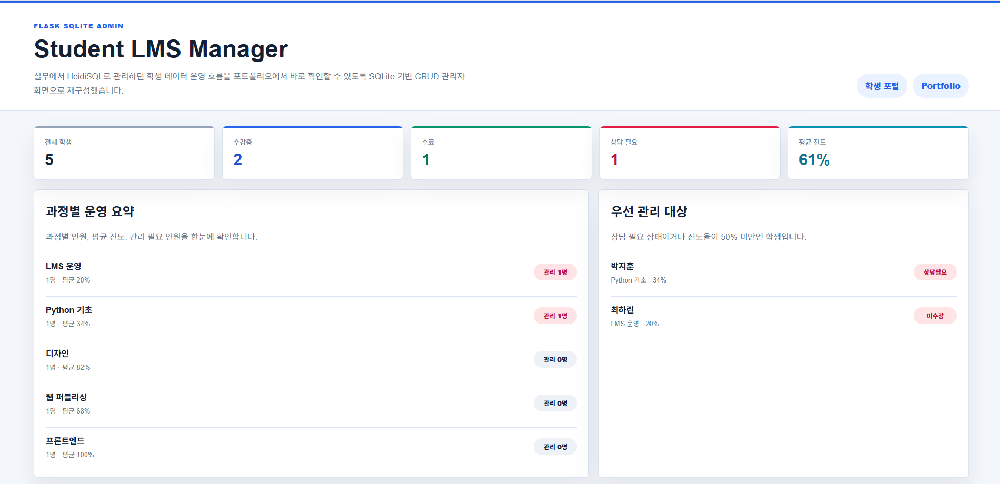

# Student LMS Manager



Flask와 SQLite를 활용해 학생 정보를 등록, 조회, 수정, 삭제할 수 있는 관리자용 LMS 데이터 관리 페이지입니다.

## Live Demo

배포된 서비스는 아래 주소에서 확인할 수 있습니다.

https://student-lms-manager.onrender.com/

채용 담당자나 리뷰어는 별도 설치 없이 위 링크로 접속해 기능을 확인할 수 있습니다.

## 확인 방법

Live Demo 접속 후 아래 흐름으로 주요 기능을 확인할 수 있습니다.

1. 학생 등록 폼에서 이름, 연락처, 과정, 상태, 진도를 입력하고 학생을 추가합니다.
2. 상단 검색창에서 이름, 연락처, 이메일, 메모 기준으로 데이터를 검색합니다.
3. 상태 또는 과정 필터를 적용해 목록이 바뀌는지 확인합니다.
4. 학생 목록의 수정 버튼으로 진도율이나 메모를 변경합니다.
5. 과정별 운영 요약과 우선 관리 대상이 자동으로 갱신되는지 확인합니다.
6. `학생 포털` 버튼을 눌러 학생용 화면에서 수강 상태와 담당자 메모를 확인합니다.
7. CSV 내보내기로 현재 목록 데이터를 다운로드합니다.
8. 삭제 버튼으로 테스트 데이터를 삭제합니다.
9. 데모 데이터 초기화 버튼으로 샘플 데이터를 복구합니다.

## 제작 배경

실무에서 HeidiSQL로 직접 관리하던 학생 운영 데이터를 웹 관리자 페이지에서 검색, 필터링, 등록, 수정, 삭제, CSV 내보내기까지 가능하도록 Flask + SQLite 기반 CRUD 시스템으로 재구성했습니다.

기존처럼 MySQL 기반으로 구현할 수도 있었지만, 포트폴리오 프로젝트로 그대로 구성할 경우 보는 사람이 직접 실행하려면 MySQL 설치, DB 계정 설정, 테이블 생성 과정이 필요해 테스트 환경이 무거워지는 단점이 있습니다.

이 프로젝트는 채용 담당자나 리뷰어가 더 쉽게 실행하고 확인할 수 있도록 SQLite를 사용했습니다. 별도의 DB 서버 설치 없이 프로젝트를 실행하면 `data/lms.db` 파일이 자동으로 생성되어 CRUD 기능을 바로 테스트할 수 있습니다.

## 주요 기능

- 학생 등록, 수정, 삭제
- 관리자 화면과 학생 포털 화면 분리
- 이름, 연락처, 이메일, 메모 검색
- 수강 상태 및 과정별 필터링
- 전체, 수강중, 수료, 상담필요, 평균 진도 통계 표시
- 과정별 인원, 평균 진도, 관리 필요 인원 요약
- 상담 필요 또는 진도율 50% 미만 학생 자동 분류
- 학생별 수강 진도 관리
- 학생용 수강 상태, 진도율, 담당자 메모 확인 화면
- 등록/수정/삭제 완료 알림
- 현재 필터 조건 기준 CSV 내보내기
- 공개 데모 환경을 위한 샘플 데이터 초기화
- SQLite 기반 데이터 저장
- 모바일, 태블릿, 데스크톱 반응형 UI
- 모바일 화면에서 학생 테이블을 카드형 목록으로 자동 전환

## 구현 포인트

- Flask 라우팅으로 목록 조회, 생성, 수정, 삭제 요청을 분리했습니다.
- SQLite 테이블을 앱 실행 시 자동 생성하도록 구성했습니다.
- 검색어와 필터 조건을 조합해 동적 SQL 조회가 가능하도록 구현했습니다.
- 진도율은 서버에서 0~100 범위로 검증해 잘못된 값이 저장되지 않도록 처리했습니다.
- 수강 상태와 진도율을 기준으로 우선 관리 대상을 자동 분류했습니다.
- 동일한 학생 데이터를 관리자 화면과 학생 포털 화면에서 서로 다른 관점으로 보여주도록 구성했습니다.
- 현재 검색/필터 결과를 CSV로 내려받을 수 있도록 export 라우트를 구현했습니다.
- 공개 배포 페이지에서 테스트 데이터가 변경되어도 샘플 데이터를 다시 복구할 수 있도록 초기화 기능을 추가했습니다.
- CSS 미디어쿼리를 사용해 모바일, 태블릿, 데스크톱 레이아웃을 분리하고 작은 화면에서는 학생 테이블을 카드형 목록으로 전환했습니다.
- Render 배포를 위해 `PORT` 환경변수와 `gunicorn` 실행 명령을 적용했습니다.

## 사용 기술

- Python
- Flask
- SQLite
- HTML
- CSS
- JavaScript
- Gunicorn

## 로컬 실행

코드를 직접 내려받아 실행하는 경우 아래 명령어를 사용합니다.

```powershell
git clone https://github.com/aitk369/student-lms-manager.git
cd student-lms-manager
pip install -r requirements.txt
python app.py
```

로컬 실행 후 브라우저에서 아래 주소로 접속합니다.

```text
http://127.0.0.1:5000
```

`127.0.0.1`은 현재 실행 중인 자기 컴퓨터를 의미합니다. 배포된 서비스를 보는 경우에는 위의 Live Demo 주소를 사용하고, 코드를 직접 실행하는 경우에만 이 로컬 주소를 사용합니다.

## 배포 정보

이 프로젝트는 Render Web Service를 사용해 배포했습니다.

```text
Deploy Platform: Render
Runtime: Python 3
Build Command: pip install -r requirements.txt
Start Command: gunicorn app:app --bind 0.0.0.0:$PORT
```

Render 무료 플랜은 일정 시간 접속이 없으면 서비스가 잠시 대기 상태로 전환될 수 있어, 첫 접속 시 로딩이 몇 초 이상 걸릴 수 있습니다.

## 포트폴리오 설명 예시

Student LMS Manager는 교육 운영자가 학생 데이터를 관리할 수 있도록 제작한 Flask 기반 LMS 관리 프로젝트입니다. 관리자 화면에서는 학생 등록, 검색, 필터링, 수정, 삭제, 과정별 운영 요약, 우선 관리 대상 자동 분류, CSV 내보내기와 데모 데이터 초기화를 제공하고, 학생 포털 화면에서는 학생이 자신의 수강 상태, 진도율, 담당자 메모를 확인할 수 있도록 구성했습니다. 실무에서 HeidiSQL로 관리하던 학생 데이터 운영 흐름을 포트폴리오에서 쉽게 확인할 수 있도록 SQLite 기반 CRUD 프로젝트로 재구성했습니다.

## 데이터 저장

로컬 실행 시 데이터는 `data/lms.db`에 저장됩니다. 배포 환경에서는 서버 재시작 또는 재배포 시 SQLite 파일이 초기화될 수 있으므로, 장기 운영용으로 확장하려면 PostgreSQL, MySQL 같은 외부 DB 연결이 적합합니다.
